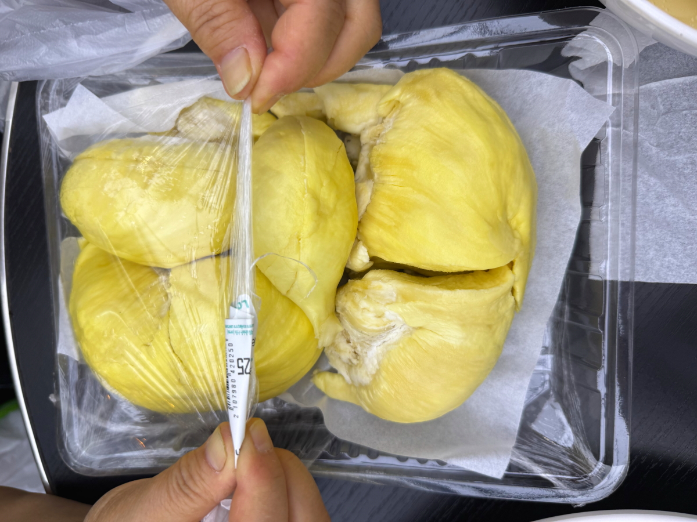
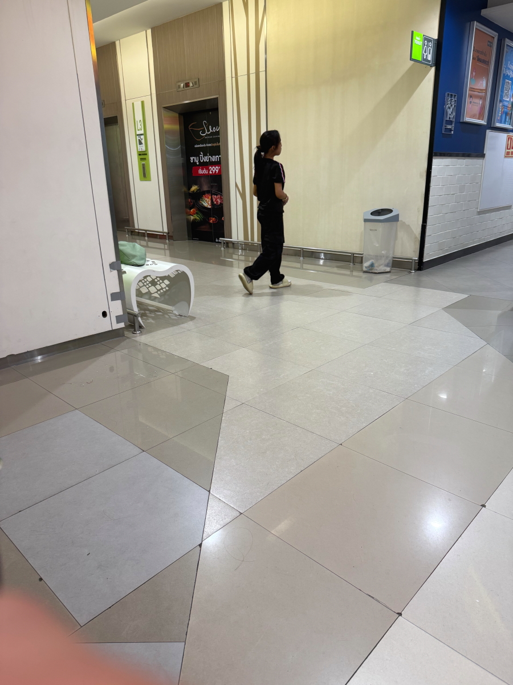
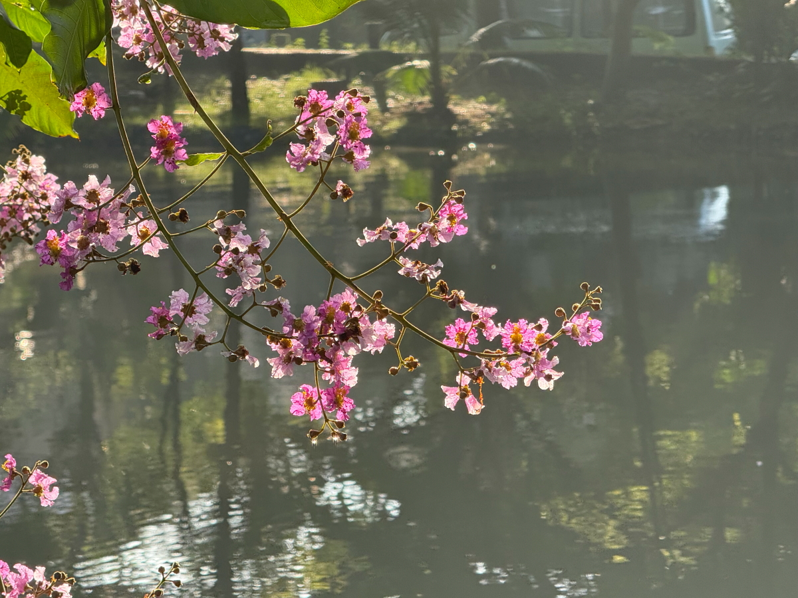

# 20250918_bangkok

<html lang="ja" data-loaded="false" data-scrolled="false" data-spmenu="closed">
<head>

<meta charset="UTF-8">
<meta http-equiv="Content-Type" content="text/html; charset=UTF-8">
<meta http-equiv="X-UA-Compatible" content="IE=EmulateIE10" />
<meta http-equiv="X-UA-Compatible" content="IE=edge">

<meta name="viewport" content="width=device-width, initial-scale=1.0">

<!--ここから上はお決まりの定型文です-->

<!--ここからが表現の書式などを決めるcssという部分-->

<link href="https://cdnjs.cloudflare.com/ajax/libs/lightbox2/2.7.1/css/lightbox.css" rel="stylesheet">

</head>

<body>

モバイル端末をお使いの場合は、画面を横向きにすると
背景画像の横方向がご覧頂けます。

<!--ここ上は、ほぼそのまま使います！-->

<!--QRコードの挿入例-->

 アクセス用QRコード

<marquee direction="left" scrollamount="20" width="30%">(^_^)/~alis</marquee>

<!--流れ文字の挿入例-->
<h1><marquee behavior="left">!!! 2025/09/16-18、お昼のラーメンから、朝の街まで!!!</marquee></h1>

                          

<!--ここから下が、本体部分-->
    

 
<h2>16日、お昼は近くのフードコートでラーメン</h2>

    
<h2>帰りに寄った材料屋さんの仏壇</h2>

    
<h2>材料屋さんには荷台に乗った作業員の皆様も集まります</h2>

    
<h2>西の空に傾いたお日様バックに赤信号のカウントダウン、デジタル表示の数字はシャッタースピードの影響でスルー</h2>

    
<h2>銀行で本日の両替レートをチェック、円 → バーツは0.2150でちょっと安め</h2>

    
<h2>4階のフードコートで晩御飯</h2>

    
<h2>この日はスープ付きチャーハン</h2>

    
<h2>1階のスーパーで買ってきたドリアンがデザート、かなりズッシリしてるので2人でも全部は食べられません</h2>

    
<h2>2階フロアに本屋さんがあったので覗いてみます</h2>

    
<h2>タイの文字なので読めません</h2>

    
<h2>日本語の表紙の本がありました</h2>

    
<h2>中は全部タイ語</h2>

    
<h2>センターホールは子供の遊び場スペース</h2>

    
<h2>ダイソーがありました、値段は約4倍</h2>

    
<h2>エレベータホールのベンチは女の子のゲームスペース</h2>

    
<h2>スタバもあります</h2>

    
<h2>金の装飾品</h2>

    
<h2>車両展示場所は日替わりでメーカーが入れ替わり</h2>

    
<h2>17日、夜間の豪雨が上がって、青空の朝</h2>

<h2>緊急車両が登場</h2>

<iframe width="560" height="315" src="https://www.youtube.com/embed/7J6HP5lx6Kk?si=Kx0p14gytj-pmKoH" title="YouTube video player" frameborder="0" allow="accelerometer; autoplay; clipboard-write; encrypted-media; gyroscope; picture-in-picture; web-share" referrerpolicy="strict-origin-when-cross-origin" allowfullscreen></iframe>
    

    
<h2>池のほとりのお花に朝日が当たって輝きました</h2>

    
<h2>生垣のお花達も、朝日の中でお目覚め</h2>

    
<h2>午後には入道雲が湧き上がります</h2>

    
<h2>ショッピングモール、入り口ホールでイベント</h2>

    
<h2>最後にお面をとってご挨拶</h2>

    
<h2>この日も為替のレートは円が安めで、0.21550</h2>

    
<h2>豆乳製品の試飲、この後豆乳を4本購入</h2>

    

<iframe width="560" height="315" src="https://www.youtube.com/embed/O4u8fil2OaA?si=R5f9Zoel2BWtKOqd" title="YouTube video player" frameborder="0" allow="accelerometer; autoplay; clipboard-write; encrypted-media; gyroscope; picture-in-picture; web-share" referrerpolicy="strict-origin-when-cross-origin" allowfullscreen></iframe>
    

    
<h2>お花屋さんのお花達が綺麗</h2>

    
<h2>お兄さんの手つきが見事</h2>

<iframe width="560" height="315" src="https://www.youtube.com/embed/2pWEkDiEfao?si=78FXx-uwEg2Dy73K" title="YouTube video player" frameborder="0" allow="accelerometer; autoplay; clipboard-write; encrypted-media; gyroscope; picture-in-picture; web-share" referrerpolicy="strict-origin-when-cross-origin" allowfullscreen></iframe>
    

    
<h2>朝食用のパンも購入</h2>

    
<h2>揚げ物屋さんの支払いは画面上のQRコードでスマホ決済</h2>

    
<h2>巻貝に彫られた象さん</h2>

    
<h2>入り口ホールのイベントは終了してました</h2>

    
<h2>雨上がりの帰り道、赤信号カウントダウンは今回は撮れてあと8秒</h2>

    
<h2>晩御飯はさっき買ったチャーハン弁当</h2>

    
<h2>18日、朝の街中の風景</h2>

    
<h2>日中は道路が熱くなるので、犬の散歩は早朝</h2>

         

<!--  
<h2>再掲【暑中お見舞い（ほたる）】LINEでご挨拶・動画で送る夏のグリーティングカード / ギターbgm/蛍の光・癒し動画</h2>

<iframe width="560" height="315" src="https://www.youtube.com/embed/Z4PKDOhRzfI?si=LaAJ8dA-1izGspEO" title="YouTube video player" frameborder="0" allow="accelerometer; autoplay; clipboard-write; encrypted-media; gyroscope; picture-in-picture; web-share" referrerpolicy="strict-origin-when-cross-origin" allowfullscreen></iframe>
    
   
-->   
    
    

  
<h2>今日のBGMは 【神回】歌唱力No.1歌手とリハなしで「メロディー」セッションしたらとんでもない結果に！？【ストリートピアノ】玉置浩二/メロディー　Street piano and vocal session</h2>

<iframe width="560" height="315" src="https://www.youtube.com/embed/mhQBtsyAm6E?si=xL5pA3RDfa7JMvsQ" title="YouTube video player" frameborder="0" allow="accelerometer; autoplay; clipboard-write; encrypted-media; gyroscope; picture-in-picture; web-share" referrerpolicy="strict-origin-when-cross-origin" allowfullscreen></iframe>
    

    
  
<h2>8月17日にメタバースで披露されたまいてゃさんの新曲「Lonely game」</h2>

<iframe width="560" height="315" src="https://www.youtube.com/embed/HstFJ2_8oQA?si=QrYNv_EcIm7fALkV" title="YouTube video player" frameborder="0" allow="accelerometer; autoplay; clipboard-write; encrypted-media; gyroscope; picture-in-picture; web-share" referrerpolicy="strict-origin-when-cross-origin" allowfullscreen></iframe>
    

    
    

    
    
    <h3>「雪の中で輝くシンデレラ」by まいてゃ</h3>
<h2><a href="https://torokoid.github.io/20250219_chiangrai/maitiyaz.mp3" target="_blank">この文字クリックで再生します 下の再生ボタンでも同じ曲をループ再生します</a></h2>

    <audio controls loop>
        <source src="https://torokoid.github.io/20250219_chiangrai/maitiyaz.mp3" type="audio/mpeg">
        お使いのブラウザは audio タグをサポートしていません。
    </audio>
 
    
<!--
  
<h2>スティーブ・ジョブズの伝説の講義</h2> 
<iframe width="560" height="315" src="https://www.youtube.com/embed/XsRpvWHIVw0?si=f7IA0pv9iZWVk3VH" title="YouTube video player" frameborder="0" allow="accelerometer; autoplay; clipboard-write; encrypted-media; gyroscope; picture-in-picture; web-share" referrerpolicy="strict-origin-when-cross-origin" allowfullscreen></iframe>    
    
    
<h2>スティーブ・ジョブズ氏の講義の内容が「笑って死ぬ」by まいてゃ さんの歌の内容と大筋で同じに聞こえます 以下に再掲しますね</h2>

    
<h3>歌の後半部分しか撮れてませんが、2月16日のイベントで公開された「笑って死ぬ」 by まいてゃ 白ドレスはダンサーの玖遠さん、黒いドレスがまいてゃさん</h3>
<iframe width="560" height="315" src="https://www.youtube.com/embed/s4ZcbxAluMM?si=Xa32xo19UCNaWv0v" title="YouTube video player" frameborder="0" allow="accelerometer; autoplay; clipboard-write; encrypted-media; gyroscope; picture-in-picture; web-share" referrerpolicy="strict-origin-when-cross-origin" allowfullscreen></iframe> 
-->
    

    <h3>お気に入りの「笑って死ぬ」 by まいてゃさんも再々掲です</h3>
<h2><a href="https://torokoid.github.io/20250221_chiangrai/maitiya3.mp3" target="_blank">この文字クリックで再生します 下の再生ボタンで同じ曲をループ再生します</a></h2>

    <audio controls loop>
        <source src="https://torokoid.github.io/20250221_chiangrai/maitiya3.mp3" type="audio/mpeg">
        お使いのブラウザは audio タグをサポートしていません。
    </audio>

   
<h2>以上、お昼のラーメンから、朝の街まででした。 ここまでご覧いただきありがとうございました。</h2>

     
<h2>
<a href="https://torokoid.github.io/Mashiko_himawari_3/" target="_blank">クリックでメニューページに戻ります</a>
</h2>

   

<!-- hitwebcounter Code START -->
<a href="https://www.hitwebcounter.com" target="_blank">

あなたは 番目の訪問者です 数値は8月1日以降に立ち上げたバンコクシリーズHPの累計です
</a>   

         

  

      

<!--本体はここまで-->

<!--画面に空白地帯を作って、背景が見えるようにしています-->
                                              

<!-- フッタ -->
<footer>

Copyright 2025/09/18 alis @Bangkok

</footer>

<!--HPにさまざまなJavaScriptを呼び込むための書式-->

    
    </body>
    
</html>
